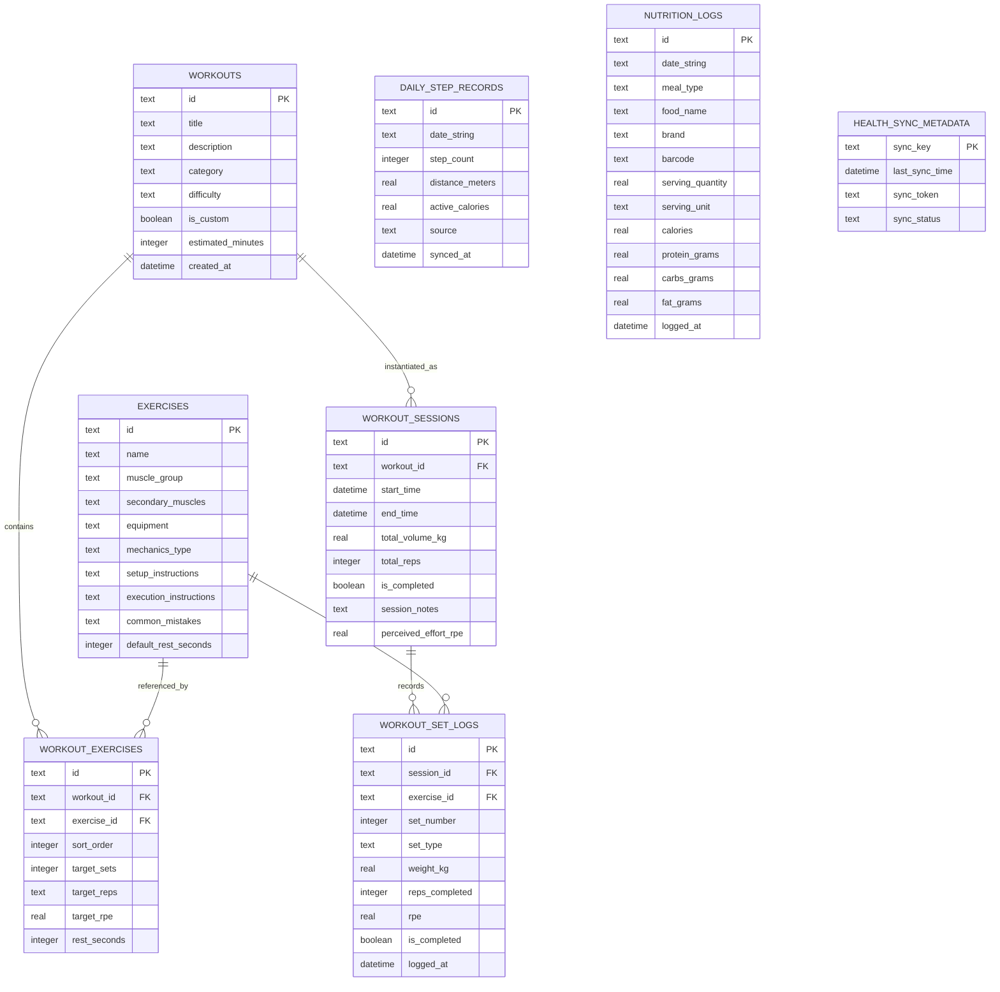

# FitTrackr Data Schema & Local Persistence Specification

**Document Version:** 1.0.0-PROD  
**Database Engine:** SQLite 3.40+ via Drift ORM (Dart)  
**Storage Tier:** On-Device Encrypted ACID Storage  
**Migration Target:** Schema Version 1  

---

## 1. Entity-Relationship (ER) Diagram



---

## 2. Drift Dart Table Definitions

```dart
// lib/data/local/tables.dart
import 'package:drift/drift.dart';

enum SetType { warmup, working, dropSet, failure }
enum ExerciseMechanics { compound, isolation }
enum WorkoutCategory { strength, hypertrophy, endurance, hiit }

class Workouts extends Table {
  TextColumn get id => text()();
  TextColumn get title => text().withLength(min: 1, max: 100)();
  TextColumn get description => text()();
  TextColumn get category => text()(); // strength, hypertrophy, hiit
  TextColumn get difficulty => text()(); // beginner, intermediate, advanced
  BoolColumn get isCustom => boolean().withDefault(const Constant(false))();
  IntColumn get estimatedMinutes => integer()();
  DateTimeColumn get createdAt => dateTime().withDefault(currentDateAndTime)();

  @override
  Set<Column> get primaryKey => {id};
}

class Exercises extends Table {
  TextColumn get id => text()();
  TextColumn get name => text().withLength(min: 1, max: 100)();
  TextColumn get muscleGroup => text()(); // chest, back, quadriceps, etc.
  TextColumn get secondaryMuscles => text()(); // JSON array or comma-separated
  TextColumn get equipment => text()(); // barbell, dumbbell, cable, machine, bodyweight
  TextColumn get mechanicsType => text()(); // compound vs isolation
  TextColumn get setupInstructions => text()();
  TextColumn get executionInstructions => text()();
  TextColumn get commonMistakes => text()();
  IntColumn get defaultRestSeconds => integer().withDefault(const Constant(90))();

  @override
  Set<Column> get primaryKey => {id};
}

class WorkoutExercises extends Table {
  TextColumn get id => text()();
  TextColumn get workoutId => text().references(Workouts, #id, onDelete: KeyAction.cascade)();
  TextColumn get exerciseId => text().references(Exercises, #id, onDelete: KeyAction.restrict)();
  IntColumn get sortOrder => integer()();
  IntColumn get targetSets => integer()();
  TextColumn get targetReps => text()(); // e.g. "8-10" or "12"
  RealColumn get targetRpe => real().nullable()(); // Rate of Perceived Exertion
  IntColumn get restSeconds => integer().withDefault(const Constant(90))();

  @override
  Set<Column> get primaryKey => {id};
}

class WorkoutSessions extends Table {
  TextColumn get id => text()();
  TextColumn get workoutId => text().references(Workouts, #id, onDelete: KeyAction.setNull).nullable()();
  DateTimeColumn get startTime => dateTime()();
  DateTimeColumn get endTime => dateTime().nullable()();
  RealColumn get totalVolumeKg => real().withDefault(const Constant(0.0))();
  IntColumn get totalReps => integer().withDefault(const Constant(0))();
  BoolColumn get isCompleted => boolean().withDefault(const Constant(false))();
  TextColumn get sessionNotes => text().nullable()();
  RealColumn get perceivedEffortRpe => real().nullable()();

  @override
  Set<Column> get primaryKey => {id};
}

class WorkoutSetLogs extends Table {
  TextColumn get id => text()();
  TextColumn get sessionId => text().references(WorkoutSessions, #id, onDelete: KeyAction.cascade)();
  TextColumn get exerciseId => text().references(Exercises, #id, onDelete: KeyAction.restrict)();
  IntColumn get setNumber => integer()();
  TextColumn get setType => text().withDefault(const Constant('working'))(); // warmup, working, dropSet, failure
  RealColumn get weightKg => real()();
  IntColumn get repsCompleted => integer()();
  RealColumn get rpe => real().nullable()();
  BoolColumn get isCompleted => boolean().withDefault(const Constant(false))();
  DateTimeColumn get loggedAt => dateTime().withDefault(currentDateAndTime)();

  @override
  Set<Column> get primaryKey => {id};
}

class DailyStepRecords extends Table {
  TextColumn get id => text()(); // e.g. "2026-09-30"
  TextColumn get dateString => text()(); // YYYY-MM-DD
  IntColumn get stepCount => integer().withDefault(const Constant(0))();
  RealColumn get distanceMeters => real().withDefault(const Constant(0.0))();
  RealColumn get activeCalories => real().withDefault(const Constant(0.0))();
  TextColumn get source => text()(); // HEALTH_CONNECT, SAMSUNG_HEALTH, HARDWARE_SENSOR
  DateTimeColumn get syncedAt => dateTime().withDefault(currentDateAndTime)();

  @override
  Set<Column> get primaryKey => {id};
}

class NutritionLogs extends Table {
  TextColumn get id => text()();
  TextColumn get dateString => text()(); // YYYY-MM-DD
  TextColumn get mealType => text()(); // breakfast, lunch, dinner, snack
  TextColumn get foodName => text()();
  TextColumn get brand => text().nullable()();
  TextColumn get barcode => text().nullable()();
  RealColumn get servingQuantity => real()();
  TextColumn get servingUnit => text()(); // g, ml, cup, oz
  RealColumn get calories => real()();
  RealColumn get proteinGrams => real()();
  RealColumn get carbsGrams => real()();
  RealColumn get fatGrams => real()();
  DateTimeColumn get loggedAt => dateTime().withDefault(currentDateAndTime)();

  @override
  Set<Column> get primaryKey => {id};
}

class HealthSyncMetadata extends Table {
  TextColumn get syncKey => text()(); // "STEPS", "CALORIES", "HEART_RATE"
  DateTimeColumn get lastSyncTime => dateTime()();
  TextColumn get syncToken => text().nullable()();
  TextColumn get syncStatus => text()(); // "SUCCESS", "FAILED", "IN_PROGRESS"

  @override
  Set<Column> get primaryKey => {syncKey};
}
```

---

## 3. High-Performance SQL Indices

To maintain instantaneous 60/120 FPS chart scrubbing and zero query latency during workout logging, the following SQLite indices are applied:

```sql
-- Fast lookup of exercise sets for an active or completed workout session
CREATE INDEX idx_workout_set_logs_session ON workout_set_logs(session_id, exercise_id, set_number);

-- Fast 1RM estimation & historical progression for a specific exercise over time
CREATE INDEX idx_workout_set_logs_exercise_history ON workout_set_logs(exercise_id, logged_at DESC);

-- Fast date-based querying for step analytics (7-day, 30-day, 90-day aggregations)
CREATE INDEX idx_daily_steps_date ON daily_step_records(date_string DESC);

-- Fast lookup of today's nutrition logs
CREATE INDEX idx_nutrition_logs_date ON nutrition_logs(date_string, meal_type);

-- Fast lookup of workout exercises ordering
CREATE INDEX idx_workout_exercises_order ON workout_exercises(workout_id, sort_order ASC);
```

---

## 4. Key DAO Query Specifications

### 4.1 1-Rep Max (1RM) Historical Progression Query
Calculates the estimated maximum for a given exercise across all historical completed sets using the Brzycki equation:
$$\text{Estimated 1RM} = \text{weight} \times \left(\frac{36}{37 - \text{reps}}\right)$$

```sql
SELECT 
    date(logged_at) AS session_date,
    MAX(weight_kg * (36.0 / (37.0 - MIN(reps_completed, 10)))) AS estimated_1rm,
    weight_kg AS top_set_weight,
    reps_completed AS top_set_reps
FROM workout_set_logs
WHERE exercise_id = :exerciseId 
  AND is_completed = 1 
  AND reps_completed > 0 
  AND reps_completed <= 12
GROUP BY date(logged_at)
ORDER BY session_date ASC;
```

### 4.2 Weekly Muscle Group Tonnage Query
Calculates total volume ($kg$) lifted per muscle group over the last 30 days:

```sql
SELECT 
    e.muscle_group,
    SUM(sl.weight_kg * sl.reps_completed) AS total_volume_kg,
    COUNT(DISTINCT s.id) AS session_count
FROM workout_set_logs sl
JOIN exercises e ON sl.exercise_id = e.id
JOIN workout_sessions s ON sl.session_id = s.id
WHERE sl.is_completed = 1
  AND sl.logged_at >= datetime('now', '-30 days')
GROUP BY e.muscle_group
ORDER BY total_volume_kg DESC;
```
