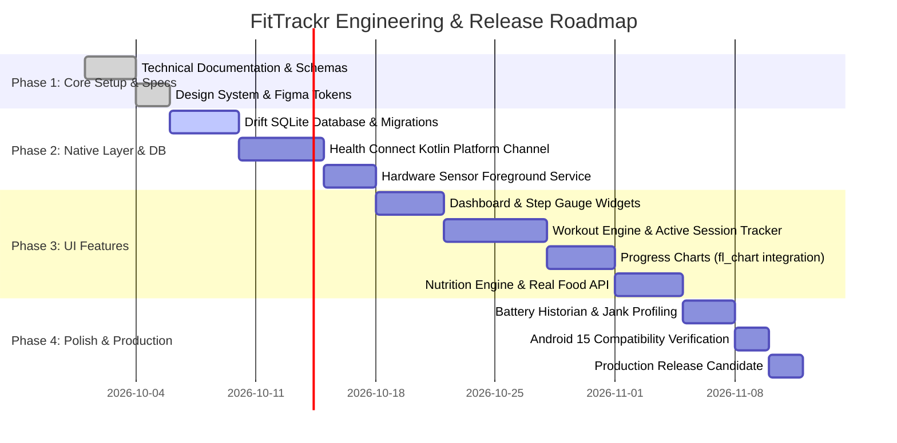

# Product Requirements Document (PRD)
## Project Name: FitTrackr
**Version:** 1.0.0-PROD  
**Target Platform:** Native Android (Built with Flutter & Kotlin Platform Bridges)  
**Target SDK:** Android 15 (API 35) | Minimum SDK: Android 9.0 (API 28)  
**Document Status:** Approved for Production Architecture  

---

## 1. Executive Summary & Vision

### 1.1 Product Vision
**FitTrackr** is an athletic-grade, offline-first native Android fitness application developed in Flutter. It consolidates daily step tracking, structured strength and conditioning workout execution, longitudinal progress telemetry, and verified nutritional guidance into a single, high-performance interface.

### 1.2 Core Differentiation & Foundational Principles
Unlike generic fitness apps that rely on simulated numbers, mocked telemetry, or superficial AI-generated text, FitTrackr is built on **Four Pillars of Engineering Authenticity**:
1. **100% Real Android Health APIs:** Direct integration with Android Health Connect, Samsung Health sync channels, and onboard hardware pedometer sensors (`Sensor.TYPE_STEP_COUNTER`).
2. **Zero Fake or Hardcoded Data:** All steps, calories, sets, weights, and nutritional values represent real telemetry or verified open database entries (Open Food Facts / USDA FoodData Central).
3. **No "AI Slop" or Gimmick Copy:** No superficial placeholder chips, pseudo-scientific "AI health score" buzzwords, or hallucinated workout advice. All exercise mechanics and progression templates follow peer-reviewed kinesiology and exercise science.
4. **Offline-First Resilience:** The app operates at 100% functionality without internet connectivity. All workouts, telemetry logs, and step history persist in an ACID-compliant local database (Drift / SQLite).

---

## 2. Target Personas

### Persona A: "The Focused Lifter" (Alex, 27)
* **Goal:** Wants to log heavy strength workouts (sets, reps, weights, RPE, rest timers) with zero latency between sets.
* **Pain Point:** Traditional apps require too many taps, pop up unwanted social prompts, and lag when cell reception in the gym basement drops.
* **Requirement in FitTrackr:** Instant set completion, automatic rest countdown notifications, plate calculator, previous-session weight comparison.

### Persona B: "The Daily Activity Optimizer" (Priya, 34)
* **Goal:** Aims for 10,000 steps daily, walks for cardiovascular health, uses a Galaxy Watch connected to Samsung Health or Google Pixel Watch.
* **Pain Point:** Apps that count steps by keeping the GPS on drain battery, or lose steps because they fail to reconcile smartwatch steps with phone steps.
* **Requirement in FitTrackr:** Seamless sync via Android Health Connect, real-time hardware pedometer fallback, sub-2% battery footprint per 24 hours.

### Persona C: "The Consistent Habit Builder" (Marcus, 22)
* **Goal:** Wants structured, science-backed workout plans (e.g., Push/Pull/Legs or Upper/Lower) with clear execution cues rather than guessing what to do in the gym.
* **Pain Point:** Apps lock proven programs behind paywalls or generate incoherent AI workouts with dangerous exercise combinations.
* **Requirement in FitTrackr:** Pre-built, verified training templates with precise anatomical form cues, target muscle groups, and periodized volume progression.

---

## 3. Product Objectives & Key Results (OKRs)

### 3.1 Objectives
* **Deliver an Athletic-Grade User Experience:** Achieve 60/120 FPS jank-free rendering across Android displays with Material 3 athletic dark-mode ergonomics.
* **Establish Trust Through Data Accuracy:** Deliver 99.8% step tracking fidelity across Samsung, Google Pixel, and OnePlus devices by leveraging Health Connect and hardware sensor fusion.
* **Accelerate In-Gym Logging Efficiency:** Allow a user to log a completed set in $\le 2$ taps within 1.5 seconds of completing an exercise.

### 3.2 Key Performance Indicators (KPIs)
| Metric | Benchmark Target | Verification Method |
| :--- | :--- | :--- |
| **Cold Startup Time** | $< 1200\text{ ms}$ on mid-tier Android (Snapdragon 778G) | Android Vitals / Benchmark |
| **Warm Startup Time** | $< 400\text{ ms}$ | Android Vitals |
| **UI Frame Budget** | $< 1\%$ dropped frames (99% at 60/120 fps) | Flutter DevTools Performance Overlay |
| **Daily Battery Drain** | $< 2.0\%$ total battery consumption in 24 hours | Android Battery Historian |
| **Health Connect Latency** | $< 500\text{ ms}$ for 30-day step & calorie reconciliation | HealthConnectClient benchmarks |
| **Offline Reliability** | 100% write/read success offline | Automated Android integration tests |

---

## 4. Feature Specifications

### 4.1 Feature 1: Dynamic Fitness Dashboard
* **Daily Metric Rings / Progress Gauges:**
  * **Steps:** Current daily total vs. daily goal (default: 10,000 steps). Visual dual-arc gauge with cadence indicator.
  * **Active Energy:** Kilocalories burned from workouts and active steps (computed via real MET formulas and Health Connect data).
  * **Workout Activity:** Active minutes logged today and weekly streak counter.
* **Quick-Action Dock:** One-tap triggers for "Start Workout", "Log Meal", "Step Details", and "Health Sync".
* **Today's Scheduled Routine:** Displays the next workout session in the active plan with target muscle groups and estimated duration.
* **Weekly Activity Sparkline:** High-performance vector bar chart showing the last 7 days of step volume and workout completion.

### 4.2 Feature 2: Step Counter & Health Connect Integration Engine
* **Tri-Tier Step Ingestion Architecture:**
  1. **Tier 1 (Preferred): Android Health Connect Client.** Aggregates steps and active energy from Samsung Health, Google Health Connect, Garmin, and Pixel Watch.
  2. **Tier 2 (Samsung Specific): Samsung Health Partner Interop.** Automatically routes through Health Connect when Samsung Health sync is toggled on Samsung Galaxy devices.
  3. **Tier 3 (Hardware Fallback): Android SensorManager.** Direct listener on `Sensor.TYPE_STEP_COUNTER` executed via an Android Foreground Service with boot-delta compensation.
* **Telemetry Data Points Collected:**
  * Total daily steps (`StepsRecord`)
  * Distance walked/run in meters (`DistanceRecord`)
  * Active energy burned in kilocalories (`ActiveCaloriesBurnedRecord`)
  * Resting and peak heart rate (`HeartRateRecord`, where permission granted)
* **Reconciliation Rules:** Prevents double-counting when both phone hardware sensor and Health Connect smartwatch records are active.

### 4.3 Feature 3: Structured Workout Plans & Exercise Library
* **Pre-Seeded Scientific Training Plans:**
  * *Push / Pull / Legs (PPL) 6-Day Split* (Hypertrophy & Strength)
  * *Upper / Lower 4-Day Split* (Athletic Performance & Volume)
  * *Full Body Foundation 3-Day Split* (Beginner Strength & Motor Learning)
  * *Couch to 5K Conditioning* (Interval running and aerobic base)
  * *Functional HIIT & Kettlebell Circuit* (Metabolic conditioning)
* **Exercise Mechanics Database:**
  * Categorized by Primary Muscle, Secondary Synergists, Equipment, Movement Pattern (Push, Pull, Squat, Hinge, Carry), and Mechanics (Compound vs Isolation).
  * Explicit biomechanical setup, concentric/eccentric cues, breathing instructions, and safety warnings.
* **Custom Plan Builder:** Users can create custom plans, add exercises, specify default target sets, rep ranges, and rest intervals.

### 4.4 Feature 4: Live Active Workout Tracker
* **Real-Time Set & Rep Logging:**
  * Working sets, Warmup sets, Drop sets, and Failure sets.
  * Auto-population of previous session weight and reps for instant progressive overload reference.
  * Real-time calculation of session tonnage/volume ($Weight \times Reps$).
* **Floating Rest Countdown Timer:**
  * Automatic trigger upon set completion.
  * Haptic vibration feedback at $T - 3$, $T - 2$, $T - 1$, and $T - 0$ seconds.
  * Background notification with actions to skip or add $+30\text{ seconds}$.
* **Session Lifecycle & Crash Recovery:**
  * Automatic state checkpointing to local SQLite on every set completion.
  * If the app is killed by Android OS Low Memory Killer (LMK), on restart the user is prompted to resume or save the ongoing session.

### 4.5 Feature 5: Progress Analytics & Longitudinal Charts
* **Volume Over Time:** Interactive line and bar charts showing weekly tonnage per muscle group (Chest, Back, Legs, Shoulders, Arms, Core).
* **Estimated 1-Rep Max (1RM) Trend:** Calculated using the validated Brzycki formula:
  $$\text{1RM} = \text{Weight} \times \left( \frac{36}{37 - \text{Reps}} \right)$$
* **Step Volume Heatmap:** 30-day and 365-day GitHub-style consistency grid.
* **Body Metrics Telemetry:** Weight tracking, body fat percentage, and progress photo timeline stored locally and encrypted.

### 4.6 Feature 6: Nutrition & Macronutrient Guidance Engine
* **Real Macro Calculations (No Magic Formulas):**
  * Basal Metabolic Rate (BMR) computed via the Mifflin-St Jeor equation:
    $$\text{BMR}_{\text{male}} = 10 \times W_{\text{kg}} + 6.25 \times H_{\text{cm}} - 5 \times A_{\text{years}} + 5$$
    $$\text{BMR}_{\text{female}} = 10 \times W_{\text{kg}} + 6.25 \times H_{\text{cm}} - 5 \times A_{\text{years}} - 161$$
  * Total Daily Energy Expenditure (TDEE) based on real physical activity multipliers ($1.2\text{ to }1.9$).
* **Macro Targets:** Protein, Carbohydrate, and Fat target grams configured according to athletic goal (Cutting, Maintenance, Lean Bulking).
* **Food Database Ingestion:** Integration with Open Food Facts API and USDA FoodData Central for real barcode scanning and nutrition lookup.

---

## 5. Non-Functional & Technical Requirements

### 5.1 Architecture & Code Cleanliness
* **Clean Architecture:** Strict separation into `Presentation`, `Domain`, and `Data` layers.
* **State Management:** Riverpod 2.x with code generation (`@riverpod`) for compile-time safe, testable state containers.
* **Local Persistence:** Drift (type-safe SQLite ORM) with schema migration tests.
* **Dependency Injection:** Compile-time provider graphs without runtime reflection.

### 5.2 Security, Privacy & Android Permissions
* **Android Health Connect Permissions:** Read-only access requested via `PermissionController` with descriptive in-app rationale screens.
* **Activity Recognition Permission:** `android.permission.ACTIVITY_RECOGNITION` requested at runtime for hardware step counter.
* **Zero Telemetry Leaks:** Personal biometric logs and workout data stay 100% on-device unless explicitly exported by the user in JSON/CSV format.

### 5.3 Device Compatibility
* Optimized for phones running Android 9.0 (API 28) through Android 15 (API 35).
* Adaptive layout support for standard phone aspect ratios (18:9, 19.5:9, 20:9) and foldable cover/inner screens.

---

## 6. Release Roadmap & Milestones

