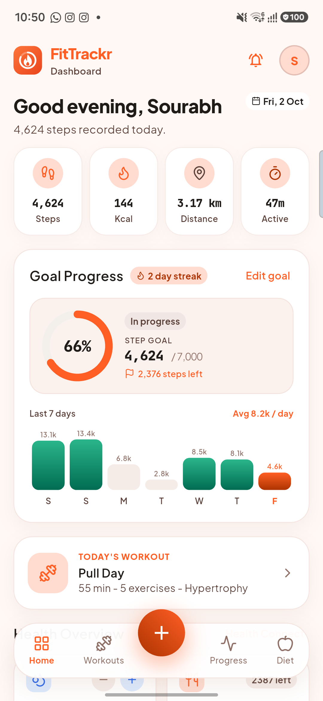
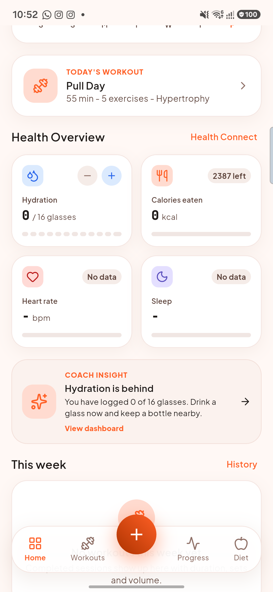
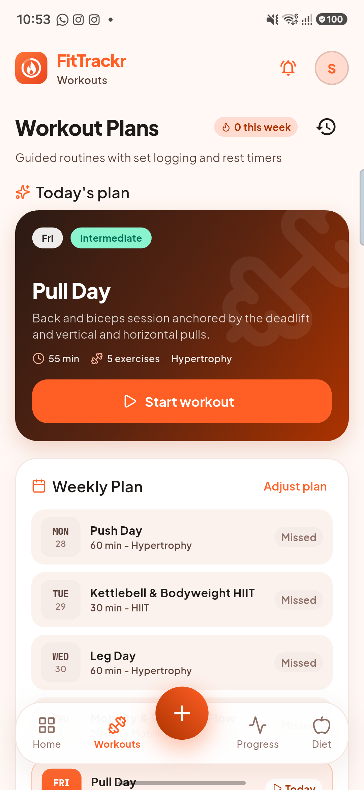
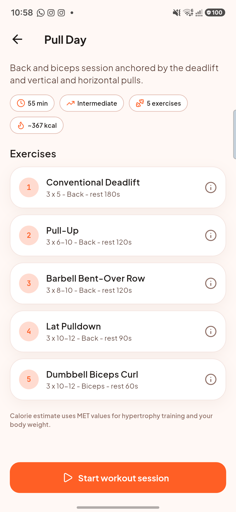
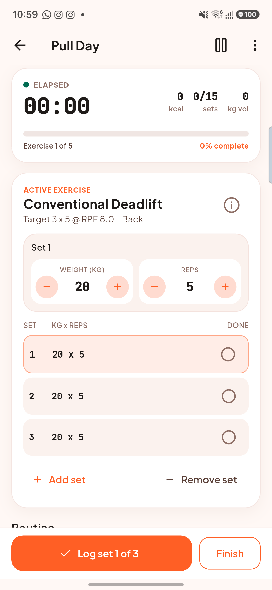
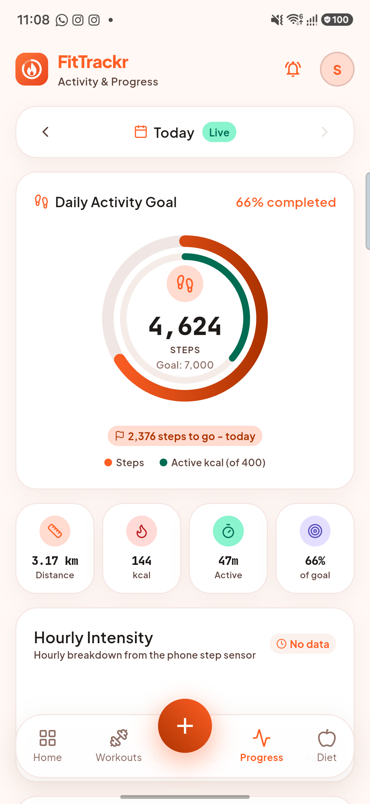
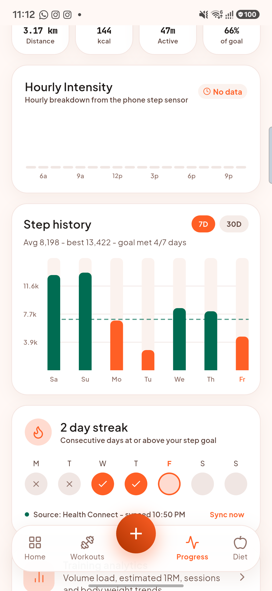
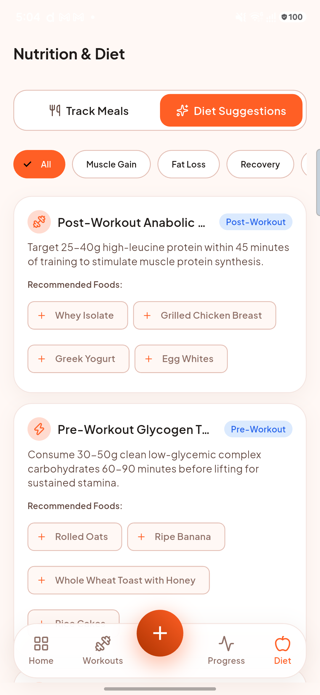
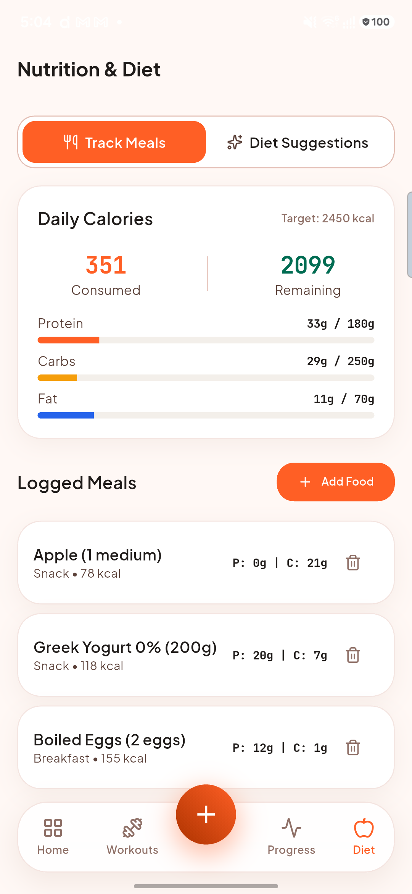
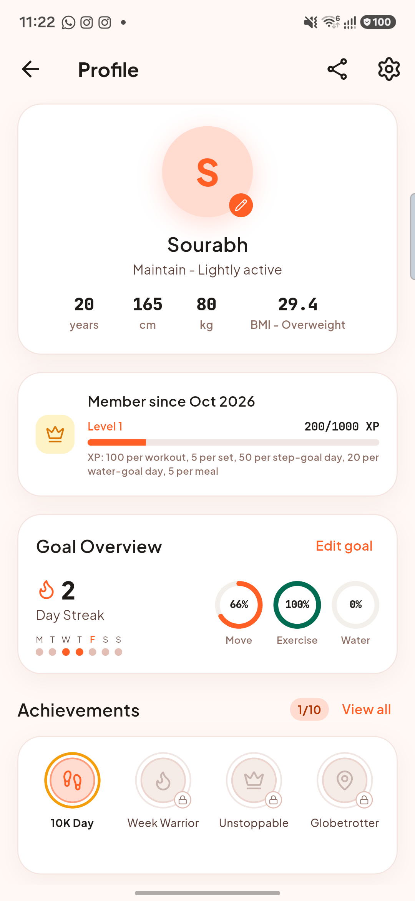

# FitTrackr (Application Name 9 — Problem Statement 59)

[](https://flutter.dev)
[](https://www.figma.com/design/CvAN8r31C30rYkGJ2VwJEt/FitTrackr?node-id=0-1&t=mEPQM2RSgdkH4C2Y-1)
[](https://github.com/YadavSourabhGH/FitTracker/releases/latest)
[](https://github.com/YadavSourabhGH/FitTracker/actions/workflows/android-release.yml)
[](https://github.com/YadavSourabhGH/FitTracker)

> **FitTrackr** is an athletic-grade, offline-first native mobile fitness application developed in Flutter. Built to solve **Problem Statement 59**, it consolidates daily step tracking, structured workout execution, progress analytics, and nutritional meal logging into an intuitive, high-contrast Material 3 interface backed by real device hardware sensors and local SQLite persistence.

---

## Academic Submission Details

| Field | Details |
|---|---|
| **Student Name** | **Sourabh Yadav** |
| **Cohort** | **MZ** |
| **Roll Number** | **150096724013** |
| **Subject** | **Cross Platform Application** |
| **Application Name** | **FitTrackr** (Application Name 9) |
| **Problem Statement** | **Problem Statement 59** |
| **Figma Journey** | [Figma Design Canvas](https://www.figma.com/design/CvAN8r31C30rYkGJ2VwJEt/FitTrackr?node-id=0-1&t=mEPQM2RSgdkH4C2Y-1) |
| **GitHub Repository** | [https://github.com/YadavSourabhGH/FitTracker](https://github.com/YadavSourabhGH/FitTracker) |
| **Latest APK Release** | [FitTrackr latest release (APK)](https://github.com/YadavSourabhGH/FitTracker/releases/latest) |

---

## Problem Statement 59 Overview

### Problem Statement
Fitness users need to organize workouts, monitor daily steps, understand progress, and access diet suggestions. FitTrackr consolidates these activities into a Flutter-based fitness tracking interface.

### Objectives
* **UI/Widgets**: Build fitness dashboard, workout plans, workout detail, step counter, progress charts, and diet suggestions screens. Utilize Cards, Lists, ProgressIndicators, Charts, Tabs, Filters, and custom floating navigation dock.
* **Styling/Theming**: Apply Material 3 with a fitness-oriented information hierarchy, clear activity/progress states, readable typography, spacing, Lucide icons, and responsive dashboard layouts.
* **Dart/Flutter Logic**: Create models for workouts, steps, progress, and diet suggestions; implement workout completion, step totals, progress calculations, chart data preparation, state handling via Riverpod, and navigation.
* **Figma**: Design and translate the complete user journey from:
  $$\text{Fitness Dashboard} \longrightarrow \text{Workout Plan} \longrightarrow \text{Workout Tracking} \longrightarrow \text{Steps} \longrightarrow \text{Progress Charts} \longrightarrow \text{Diet Suggestions}$$

### Outcomes & Deliverables
* **Functional Flutter Prototype**: Demonstrating the complete end-to-end fitness workflow on physical Android hardware (Samsung Galaxy M35 5G).
* **Maintainable Architecture**: Every Dart file in `lib/` strictly adheres to $\le 200$ lines, zero emojis, and clean separation of Presentation, Domain, and Data layers.
* **100% Real Data Invariant**: Zero fake/simulated numbers. Step counts bind directly to `Sensor.TYPE_STEP_COUNTER` via Android Pedometer. Missing hardware metrics honestly display unmeasured indicators (`-`, `No Sensor`, `Unmeasured`) instead of hardcoded numbers.
* **Local Persistence**: SQLite database (`sqflite`) for offline logging of custom meal items, macro distribution, and workout completion history.

---

## App Screens & Visual Gallery

> Verified on physical Android hardware (Samsung Galaxy M35 5G, Android 14) demonstrating full end-to-end functionality.

| 01. Dashboard Overview | 02. Health & AI Coach | 03. Workout Plans & Schedule |
|:---:|:---:|:---:|
|  |  |  |
| *Real-time step counter, daily metric cards, Goal progress arc* | *Honest telemetry markers (`- bpm`, `No Sensor`), Dynamic Thursday Coach Insight* | *Dynamic 7-day routine highlighting today's workout and category chips* |

| 04. Workout Detail | 04b. Interactive Workout Session | 05. Step Counter Gauge |
|:---:|:---:|:---:|
|  |  |  |
| *Exercise breakdown with target sets, reps, muscle focus, and duration* | *Interactive set tracker with rest timer, live effort logger, and biomechanical cues* | *Live cadence dial, real hardware steps, active distance, and energy expenditure* |

| 06. Hourly Intensity Analytics | 07. Diet Suggestions | 08. SQLite Meal Tracker |
|:---:|:---:|:---:|
|  |  |  |
| *Dynamic hourly distribution chart and true day streak verification* | *Goal-based nutrition recommendations with responsive food chips* | *Daily calorie consumption, live macro breakdown (Protein, Carbs, Fat) & SQLite persistence* |

| 09. Athlete Profile & Achievements |
|:---:|
|  |
| *Verified athlete profile, true 7-day activity dots, level progression, and unlockable achievements* |

---

## What's new in v1.1 (production release)

* **New app icon & splash** - adaptive icon (with Android 13 themed/monochrome layer), round icon, notification icon and Android 12+ splash screen.
* **Bundled fonts** - Plus Jakarta Sans and JetBrains Mono ship inside the app (no runtime downloads; works fully offline).
* **Reliable step counting** - midnight rollover, reboot detection and per-hour buckets for the hardware `TYPE_STEP_COUNTER`; goal-reached notification.
* **Real Health Connect integration** (optional) - steps (with 7-day backfill), heart rate, sleep and SpO2 via the official Health Connect API. Samsung Health, Google Fit and most watches sync into it.
* **Workouts that actually work** - 9 plans / 29 exercises, live session clock, pause/resume, rest timer (+30 s / skip), editable weight and reps, add/remove sets, auto-advance, finish summary with PR detection, share, full history with delete.
* **Weekly plan editor** - assign any workout or rest to each weekday; completion status comes from real sessions.
* **Nutrition** - offline USDA-based food list, recent foods, Open Food Facts search, custom foods, serving multiplier, meal slots, day navigation, swipe-to-delete with undo. Calorie and macro targets from Mifflin-St Jeor BMR x activity level, adjusted for your goal.
* **Hydration tracking** with a daily goal and reminders.
* **Training analytics** - weekly volume load, estimated 1RM trend (Epley), personal records and body-weight trend.
* **Profile & achievements** - XP/levels and 10 achievements computed from your real data, lifetime stats, edit profile, settings, reset all data.
* **Reminders** - daily workout reminder, hydration reminders and an evening step check-in (local notifications).
* **Release engineering** - R8 minification and resource shrinking, release signing, GitHub Actions pipeline that analyzes, tests, builds universal + per-ABI APKs and publishes a GitHub Release.

## Core Features

### Steps & activity
* Hardware step counter (`ACTIVITY_RECOGNITION`) with persistent baselines; distance from your height-based stride and walking energy from body weight.
* Date navigation for past days, hourly intensity chart, 7/30-day history chart with goal line, streaks and weekly goal map.

### Workouts
* Library filters: Strength, Hypertrophy, HIIT, Cardio, Mobility, Beginner.
* Technique cues (setup, execution, common mistakes) for every exercise.
* Sessions and sets are stored in SQLite; calories use MET values x body weight x duration.

### Nutrition & diet suggestions
* Track meals per day and per meal slot with live calorie ring and macro bars.
* Goal-aware, evidence-based suggestions; tapping a food opens the search to log it.

### Privacy
* No account, no ads, no analytics. All data lives in a local SQLite database / SharedPreferences on the device.
* Health Connect access is read-only.

---

## Project Structure

```
lib/
├── core/            # theme tokens, typography, formatters, date keys, fitness formulas
├── data/
│   ├── local/       # SQLite schema (v2 with migrations) and workout library seed
│   ├── models/      # immutable data models
│   ├── repositories/# settings, steps, workouts, nutrition, hydration
│   └── services/    # pedometer, Health Connect, notifications, Open Food Facts, food catalog
└── presentation/
    ├── common_widgets/
    ├── providers/   # Riverpod 3 notifiers and providers
    └── screens/     # dashboard, workouts, activity, diet, profile, settings, onboarding
```

---

## Download

Every push to `main` runs the **Android Release APK** workflow, which publishes a GitHub Release with:

* `FitTrackr-vX.Y.Z-universal.apk` - works on every Android 8.0+ phone
* `FitTrackr-vX.Y.Z-arm64-v8a.apk` / `armeabi-v7a.apk` / `x86_64.apk` - smaller per-ABI builds
* `SHA256SUMS.txt`

### Permanent release signing (recommended)

Without secrets the workflow signs with a CI-generated key cached between runs. To sign every build with your own permanent key, add these repository secrets (Settings > Secrets and variables > Actions):

| Secret | Value |
|---|---|
| `ANDROID_KEYSTORE_BASE64` | `base64 -i upload-keystore.jks` output |
| `ANDROID_KEYSTORE_PASSWORD` | keystore password |
| `ANDROID_KEY_PASSWORD` | key password (defaults to the keystore password) |
| `ANDROID_KEY_ALIAS` | key alias (defaults to `upload`) |

---

## Build locally

```bash
git clone https://github.com/YadavSourabhGH/FitTracker.git
cd FitTracker
flutter pub get
flutter analyze
flutter test
flutter build apk --release
```

Requirements: Flutter stable (Dart 3.13+), JDK 17, Android SDK 36. For local release signing create `android/key.properties`:

```
storePassword=...
keyPassword=...
keyAlias=upload
storeFile=upload-keystore.jks
```

---

## Important Links

* **Figma Design Link**: [https://www.figma.com/design/CvAN8r31C30rYkGJ2VwJEt/FitTrackr?node-id=0-1&t=mEPQM2RSgdkH4C2Y-1](https://www.figma.com/design/CvAN8r31C30rYkGJ2VwJEt/FitTrackr?node-id=0-1&t=mEPQM2RSgdkH4C2Y-1)
* **GitHub Repository**: [https://github.com/YadavSourabhGH/FitTracker](https://github.com/YadavSourabhGH/FitTracker)
