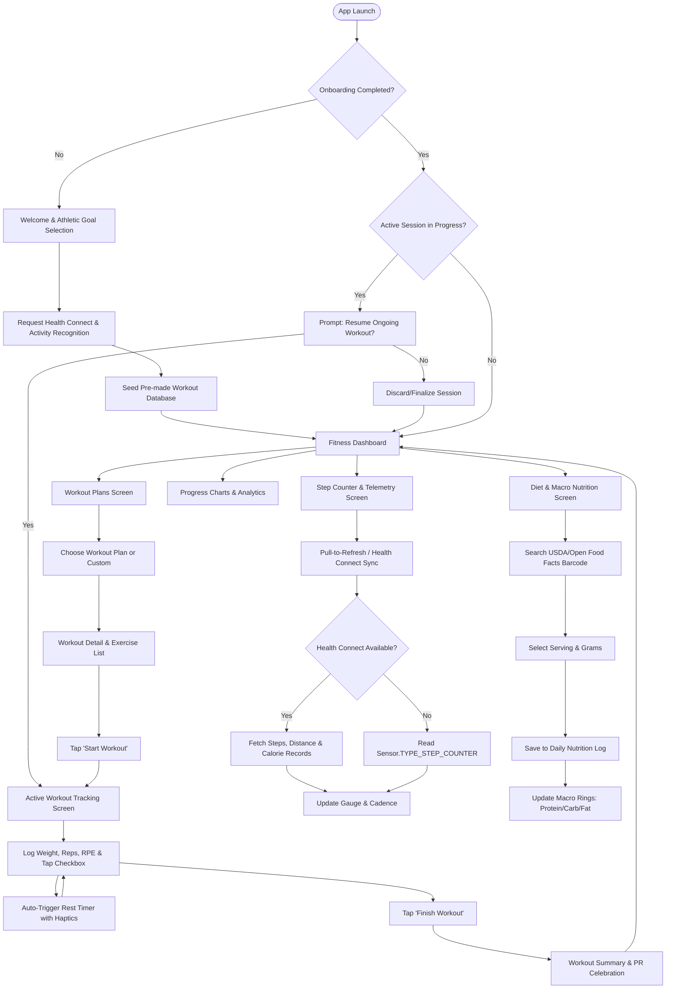
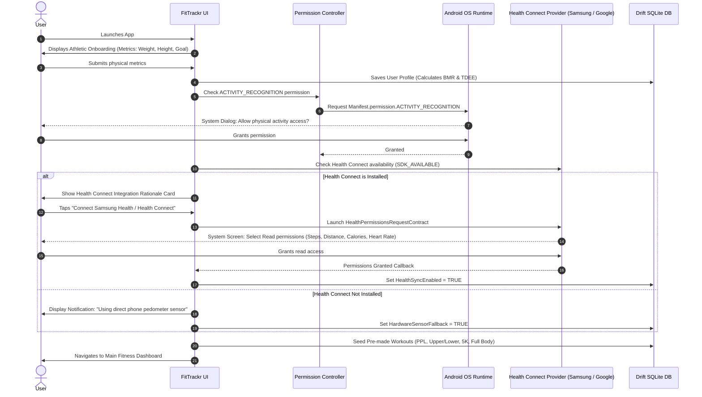
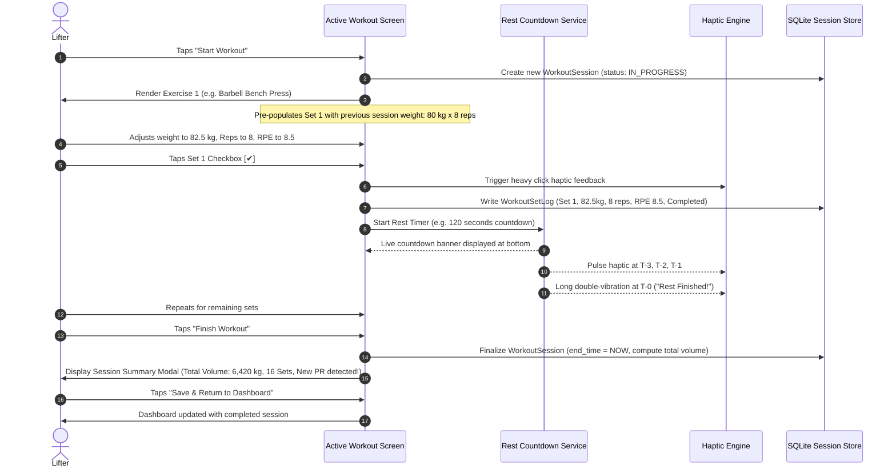

# FitTrackr End-to-End User Flow & Interaction Specification

**Document Version:** 1.0.0-PROD  
**Target:** Flutter Native Android Architecture  
**Scope:** Complete User Experience Lifecycle, Edge-Case Handling, and State Transitions  

---

## 1. Master Application Flow Overview

The core FitTrackr user journey transitions smoothly between 6 interconnected operational modules:
```
[1. Fitness Dashboard] ──► [2. Workout Plans] ──► [3. Active Tracking]
         │                          │                     │
         ▼                          ▼                     ▼
[4. Step Telemetry]    ──► [5. Progress Charts] ──► [6. Diet & Nutrition]
```

### High-Level Architecture Flowchart



---

## 2. Detailed Journey Flows

### Flow 1: First-Run Onboarding & Native Permission Onboarding
* **Trigger:** App first launch after installation or after data clear.
* **Objective:** Establish physical profile (weight, height, age, biological sex for BMR calculation) and gain runtime permissions without overwhelming the user.



---

### Flow 2: Daily Fitness Dashboard Interaction
* **Key Screen Elements:**
  * Top App Bar: User avatar, current date, Health Connect sync badge (Green = Synced, Amber = Offline, Blue = Syncing).
  * Dual-Arc Step Gauge: Large concentric circle showing today's real step count vs. goal, current walking cadence (steps/min), and distance.
  * Three Metric Micro-Cards: Active Calories (kcal), Workout Duration (mins), and Weekly Streak (days).
  * "Today's Target Routine": Quick launcher displaying the next prescribed workout from the active plan.
  * Recent Progress Bar: 7-day sparkline of volume load and step completion.

* **Interactions:**
  * **Pull-to-refresh:** Triggers synchronous background pull from Health Connect and recalculates today's daily aggregate metrics in $< 350\text{ ms}$.
  * **Tap on Step Gauge:** Navigates directly to the Step Telemetry screen.
  * **Tap on "Start Scheduled Workout":** Directly launches the active workout session modal.

---

### Flow 3: Workout Plan Exploration & Detail Inspection
* **Navigation:** Bottom Navigation Tab 2 ("Workouts").
* **Screen Structure:**
  * Top Tab Bar: "My Active Plan", "Explore Pre-Made", "Custom Workouts".
  * Filter Chips: `All`, `Strength`, `Hypertrophy`, `Full Body`, `Cardio / 5K`, `Conditioning`.
  * Plan Cards: Display plan name, frequency (e.g. "4 Days / Week"), difficulty badge, estimated weekly duration, and target muscle distribution pills.

* **Interaction Steps:**
  1. User selects "Upper / Lower Hypertrophy (4-Day)".
  2. Navigates to `WorkoutDetailScreen`.
  3. User inspects Day 1: "Upper Body Power".
  4. Exercise list displays ordered items (e.g., Barbell Bench Press, Barbell Bent-Over Row, Standing Overhead Press).
  5. User taps an exercise card: An expandable drawer reveals animated mechanics illustration, target primary muscle, secondary muscles, and technical cues (e.g., "Retract scapulae, touch lower sternum, flare elbows 45 degrees").
  6. User taps **"Start Workout"** button.

---

### Flow 4: Active Workout Tracking & Live Set Execution (The Gym Core)
* **Objective:** Frictionless, high-contrast, distraction-free logging while under physical strain.



---

### Flow 5: Step Counter Telemetry & Health App Reconciliation
* **Path:** Dashboard Step Gauge OR Tab 3 ("Steps").
* **Behavior:**
  * App checks whether Samsung Health or Health Connect is present on device.
  * If Health Connect is enabled:
    * Reads `StepsRecord` for start of day ($00:00:00$) to present.
    * Groups steps into hourly buckets for the bar chart.
    * Reads `DistanceRecord` to show exact kilometers/miles.
    * Reads `ActiveCaloriesBurnedRecord` to show metabolic expenditure.
  * If Health Connect is unavailable (e.g. older Android or user declined):
    * Reads Android `Sensor.TYPE_STEP_COUNTER`.
    * Computes daily step total using the formula:
      $$\text{Steps}_{\text{today}} = \text{SensorCurrentValue} - \text{BootOffsetValue} - \text{PriorDaysBootDelta}$$
    * Persists hourly step accumulation in local SQLite database.

---

### Flow 6: Progress Analytics & Longitudinal Charts
* **Screen:** Tab 4 ("Progress").
* **View Filters:** Segmented control for `7 Days`, `30 Days`, `90 Days`, `1 Year`, `All-Time`.
* **Chart 1: Tonnage & Volume Load:**
  * Stacked or grouped bar chart displaying volume lifted per muscle group.
  * Scrubbing interaction: Long-press on any bar shows exact volume ($kg$) and date.
* **Chart 2: Estimated 1-Rep Max (1RM) Progression:**
  * Dropdown selector for core compound movements (Bench Press, Squat, Deadlift, Overhead Press, Pull-Up).
  * Line chart showing calculated 1RM trendline with personal record markers.
* **Chart 3: Step Volume & Consistency Heatmap:**
  * Calendar grid where cell opacity corresponds to step goal fulfillment percentage.
* **Chart 4: Bodyweight & Composition:**
  * Telemetry line chart with moving 7-day average to filter out water weight fluctuations.

---

### Flow 7: Diet Guidance & Real Food Barcode / Nutrition Search
* **Screen:** Tab 5 ("Diet").
* **No AI Hallucinations:** All caloric and macronutrient values stem from the USDA FoodData Central and Open Food Facts public verified APIs.
* **Daily Macro Overview:**
  * Header shows Remaining Calories, Target Protein ($g$), Target Carbs ($g$), Target Fat ($g$).
  * Interactive circular macro breakdown ring.
* **Meal Logging Sub-Flow:**
  1. User selects Meal Category: `Breakfast`, `Lunch`, `Dinner`, `Post-Workout Snack`.
  2. User taps "Add Food" $\rightarrow$ opens search or camera barcode scanner.
  3. User enters query (e.g., "Greek Yogurt 0% Fat").
  4. Search results display verified items with brand name, serving size, calories, and protein/carb/fat content.
  5. User selects item, enters number of servings (e.g. $1.5\text{ cups}$ or $225\text{ grams}$).
  6. Food item logged to SQLite database, macro progress rings animate to new values.

---

## 3. Resilience, State Recovery & Edge Cases

### Edge Case 1: Phone Reboot or OS Memory Kill During Workout
* **Mechanism:** Every set checkmark instantly writes an immutable record to SQLite inside a database transaction (`is_completed = true`).
* **Recovery:** When FitTrackr restarts, `AppStartupNotifier` queries `SELECT * FROM workout_sessions WHERE is_finished = FALSE`.
* **User Dialog:** A non-intrusive banner appears: *"Unfinished workout from 14:22 detected. [Resume] [Discard]"*. Resuming restores all completed sets, weight values, and elapsed timer duration.

### Edge Case 2: Health Connect Permissions Revoked Externally
* **Scenario:** User revokes permission via Android System Settings $\rightarrow$ Health Connect $\rightarrow$ App Permissions.
* **Resolution:** FitTrackr wraps all Health Connect API calls in a `SecurityException` and `HealthConnectException` catch handler. Upon detecting permission loss, the app switches to the internal sensor fallback and displays an inline banner with a direct deep-link to the Health Connect permission management screen.

### Edge Case 3: Offline Mode
* **Scenario:** The user has no cellular or Wi-Fi connectivity (e.g., underground gym or airplane).
* **Resolution:** 100% of workout logging, step tracking via hardware sensor, historical charts, and locally cached food items function normally. Remote food searches queue gracefully and alert the user with an offline indicator without crashing.
